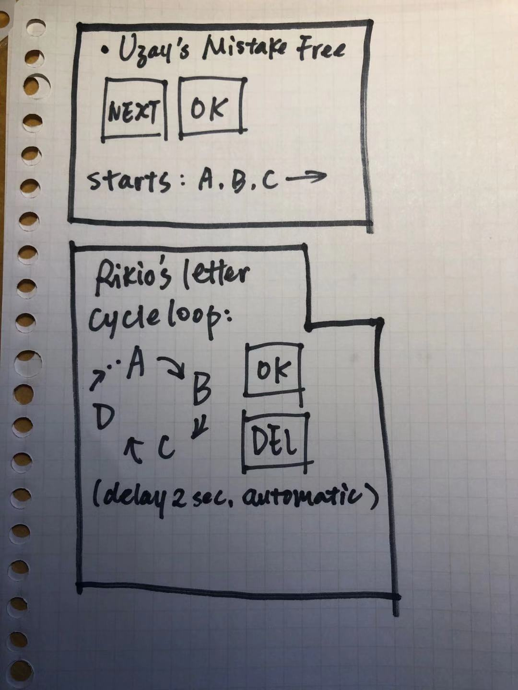
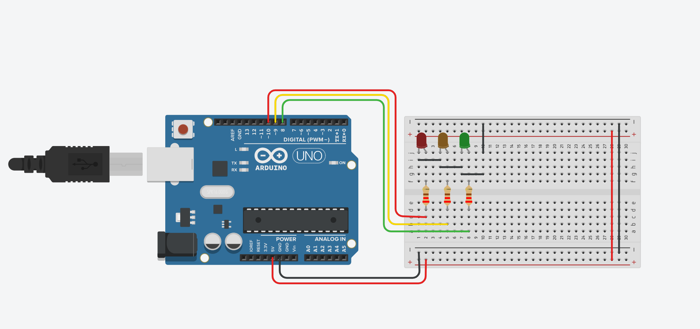
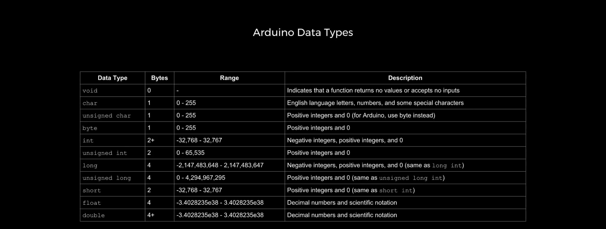
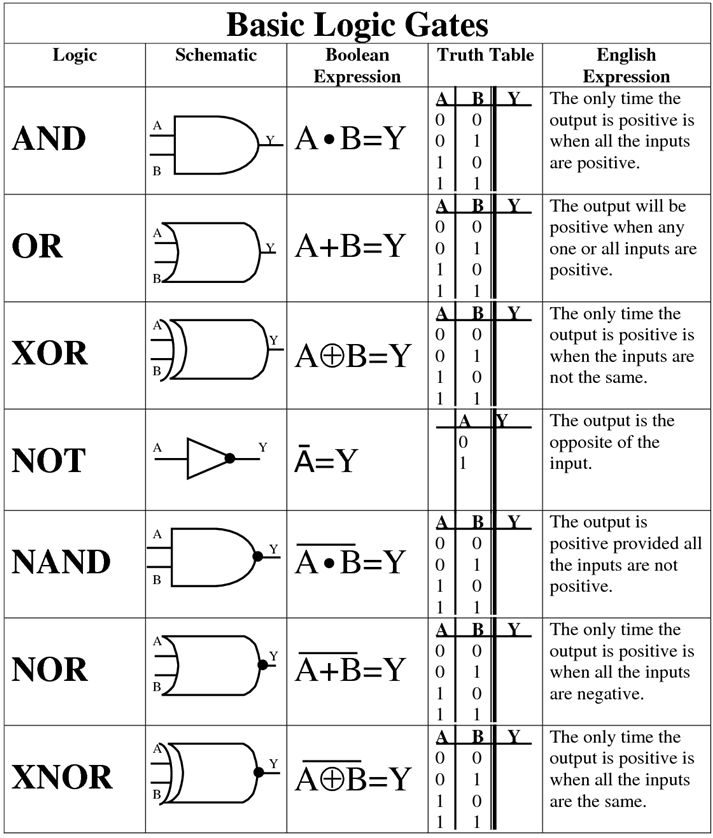
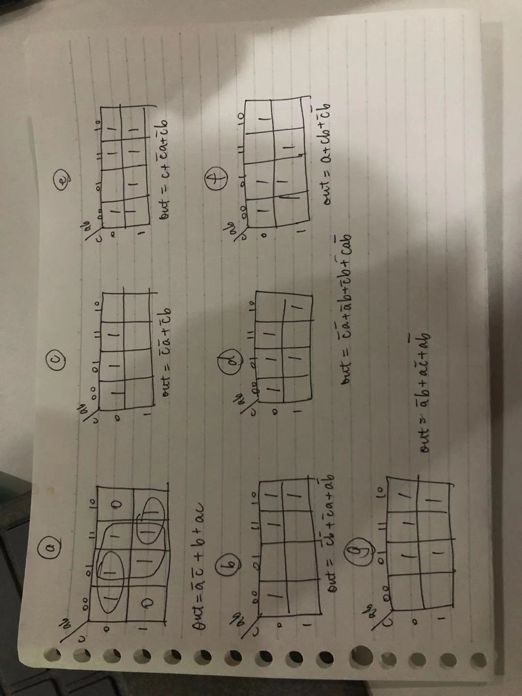
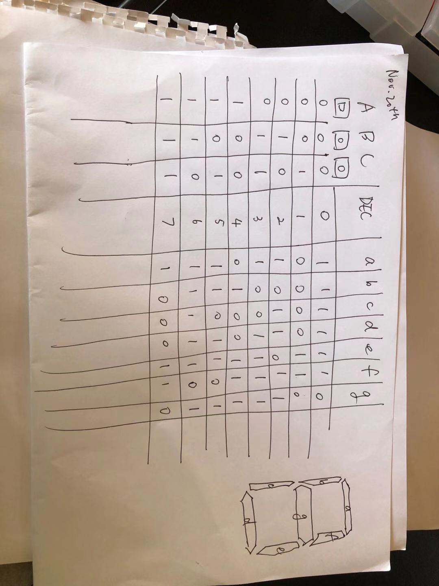
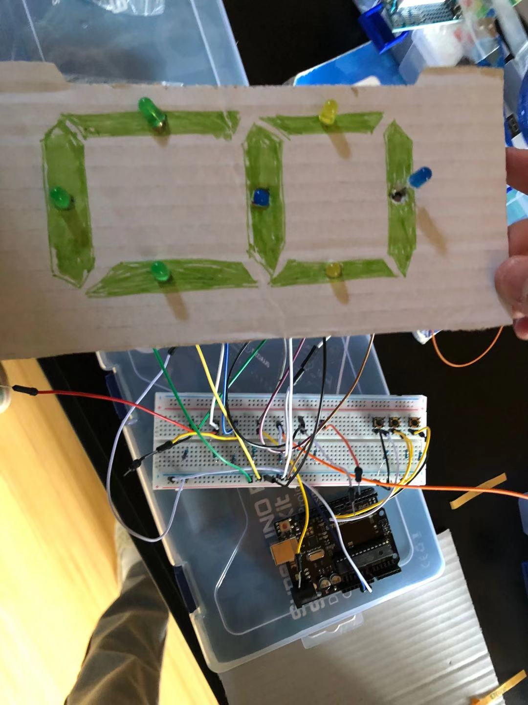
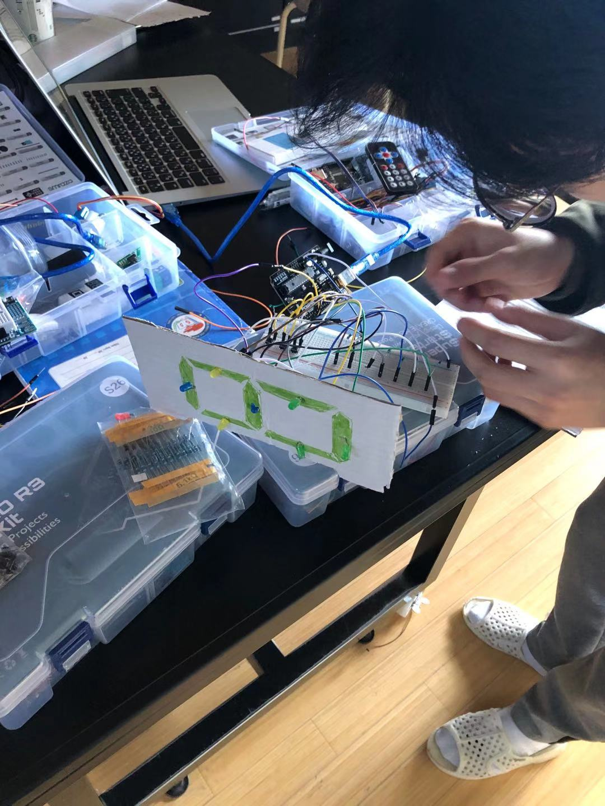
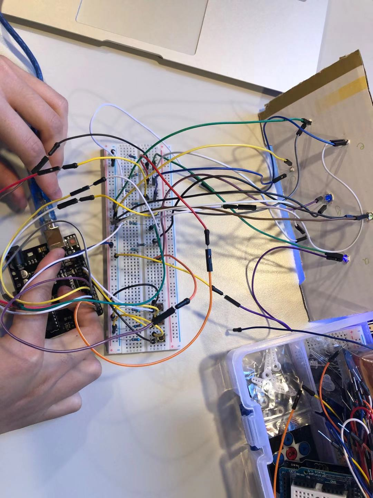

Martian Decoder
===========================

A communication tool for earth, Moon, and Mars.

Contents
-----
  1. [Planning](#planning)
  1. [Design](#design)
  1. [Development](#development)
  1. [Evalution](#evaluation)

Planning
----------

**Defining the problem (Tpoic 1.1.1)** 

The year 2015 is a year when interplanet traveling and planet expolration stepped onto a new stage. However, communication between different planets is still precautious and undeveloped. The station in the Earth can only communicate using Morse code, the station in the Moon can only communicate in Binary code. Communication with the station in Mars must be provided. 

Our client, the government of LWK on planet Earth(the most prosperous country in the year of 2050), is looking for a interplanet version of google translate, which includes basic functionality of being able to translate between Morse code, Binary, and Decimal messages from Mars, Earth, and Moon. In the case especially, our client is seeking for a program that provides a communication system that allows stations to communicate seamlessly using English. Also, limited the keyboard input on each planet's station to 2 push buttons where only 100w lights and buzzers are available. (see success criteria)

Therefore, the Martian Decoder is developed.

**Solution proposed**

In order to meet our clients' expectations and requirements, I decided to create this Martian Decoder based on the simpliest elements such as LED lights and buzzers aid by the Aruduino tool kit, where I code in the language of Modern C, with special requirements in Aruduino. Each step of development is demonstrated via the online platform Tinkercad. With the help of these tools, the program will be able to decode and translate the communication between Earth and Mars using Morse code, and the communication between Mars and the Moon using Binary code. All process and code of development are stored in Github.

- WHY Github

All scripts and documentation are stored in Github, making it easy to contribute to this open source projects, provide a clear documentation for the users, and showcase the project to our clients.

- WHY Tinkercad

Because Tinkercad is a free, online 3D modeling program that runs in a web browser, known for its simple interface and ease of use. Therefore making the simulation of each of our procedure extremely easy.

- WHY Arduino

An Arduino board is a one type of microcontroller based kit. Advantages of using Arduino include:
1. The software of the Arduino is well-suited with all kinds of in operation systems like Linux, Windows, and Macintosh, etc.
1. It also comes with open supply software system feature that permits tough software system developers to use the Arduino code to merge with the prevailing programing language libraries and may be extended and changed.
1. We are learning how to construct and code basic curcuits, where Arudino is a perfect toolkit for that learning purpose.
1. Comparing BASH to C

--- | BASH | C
--- | --- | ---
PROS | 1. Easy to learn and don't need ";" 2. already installed; 3. powerful with administrative tasks; 4. handy IT admin  | 1. Editing tools(IDE); 2. "Window"; 3. Users can develope their own electronic kit; 4. extremely powerful; simple syntax.
CONS | 1. syntax is unforgiving; 2. limited to terminal; 3. not a lot of resources on internet | 1. usage of additional programs to check your scripts; 2. too many unnecessary syntax

**Success criteria**

Expected measureable outcomes by the client includes:
1. Communication between Earth and Mars uses Morse code.
1. Communication between Mars and the Moon uses Binary code.
1. Provide a communication system that allow stations to communicate seamlessly using English.
1. Keyboard input on each station is limited to 2 push buttons. 
1. 100W lights are buzzers are available.
1. The program should has a high accuracy and speed in translating.
1. The program should be able to separate each language from each other.

Design
----------

Development
----------
Nov.6th

### 1. Consider the case of a challenged person who cannot operate a keyboard or a mouse. 
What options could we provide to allow this person interact with the computer?

**Fig.1** The two ways proposed by Rikio and Uzay. Uzay's idea is based on a static alphabet where one button is used for the "next letter" and the other one "OK" for inputting the letter, with one drawback of not able to make any mistakes while typing; while Rikio's idea is based on the alphabet looping itself automaticly, therefore having the functionality of input (button"OK") and delete(button"DEL").

**my idea:**
To put multiple functionalities on the buttons, therefore making one of the buttons "func", and the other "delete". That is, to always have the alphabet displayed to users as a table(i.e 5 times 6), meantime giving the the "func" button functionalities such as "one press to the right""two press to the left""long press go down", along with the other botton with the delete fuction.

### 2. Create a traffic light using Arduino


_code for traffic light:_
```c,.h
 int red = 10;
 int yellow = 9;
 int green = 8;

void setup()
{
  pinMode(red, OUTPUT);
  pinMode(yellow, OUTPUT);
  pinMode(green, OUTPUT);
  digital.write(green, HIGH);
}

void loop()
{
  changeLights();
    delay(15000);
}

void changeLights(){
    // green off, yellow on for 3 seconds
    digitalWrite(green, LOW);
    digitalWrite(yellow, HIGH);
    delay(3000);

    // turn off yellow, then turn red on for 5 seconds
    digitalWrite(yellow, LOW);
    digitalWrite(red, HIGH);
    delay(5000);

    // red and yellow on for 2 seconds (red is already on though)
    digitalWrite(yellow, HIGH);
    delay(2000);

    // turn off red and yellow, then turn on green
    digitalWrite(yellow, LOW);
    digitalWrite(red, LOW);
    digitalWrite(green, HIGH);
    delay(3000);
}
```

__demonstration:__ 


**_Problem(fixed): how do variables and 'void' work in arduino_**

Sol to the first problem:



**void**: The void keyword is used only in function declarations. It indicates that the function is expected to return no information to the function from which it was called.

_reference:_ “Void.” Arduino Reference, https://www.arduino.cc/reference/tr/language/variables/data-types/void/.

### 3. Converting decimals to binary, shown by LED lights how to count from 0 to 15

- How to count from 0 to 15 in binary:

Dec | BIN | Hexadecimal
--- | --- | ---
0 | 0000 | 0
1 | 0001 | 1
2 | 0010 | 2 
3 | 0011 | 3
4 | 0100 | 4
5 | 0101 | 5
6 | 0110 | 6
7 | 0111 | 7
8 | 1000 | 8
9 | 1001 | 9
10 | 1010 | A
11 | 1011 | B
12 | 1100 | C
13 | 1101 | D
14 | 1110 | E
15 | 1111 | F

_This code shows how to convert decimals to binary (up to 4 binary digits), shown by 4 LED lights, uisng number 5, 10, and 8 as an example_

```c,.h
int LED1 = 8;
int LED2 = 9;
int LED3 = 10;
int LED4 = 11;

void setup()
{
  pinMode(LED1, OUTPUT);
  pinMode(LED2, OUTPUT);
  pinMode(LED3, OUTPUT);
  pinMode(LED4, OUTPUT);
}

void loop()
{
  binary(5);
  delay(2000);
  binary(10);
  delay(2000);
  binary(8);
}

void binary(int num)
{
  if( num%2 == 0 )
  {
    digitalWrite(LED1, LOW);
  }
    else if( num%2 == 1 )
    {
      digitalWrite(LED1, HIGH);
  }
  if( num%4 > 1)
  {
    digitalWrite(LED2, HIGH);
  }
    else
    {
      digitalWrite(LED2,LOW);
  }
  if ( num%8 >= 4)
  {
    digitalWrite(LED3, HIGH);
  }
    else
    {
      digitalWrite(LED3, LOW);
  }
  if ( num%16 >= 8)
  {
    digitalWrite(LED4, HIGH);
  }
    else
    {
      digitalWrite(LED4, LOW);
  }
}
```
_demonstration:_ 


**_Problem(fixed): how to convert decimal numbers to binary numbers?_**

Sol: find the pattern digit by digit, and use mode to display each LEDlight.

### 4. Create one program curcuit that implements each of the tables below:

- table 1

Button A | Button B | Out 1 | Out 2
--- | --- | --- | ---
0 | 0 | 1 | 0
0 | 1 | 0 | 1
1 | 0 | 1 | 1
1 | 1 | 0 | 0

- table 2

Button A | Button B | Out 1 | Out 2
--- | --- | --- | ---
0 | 0 | 1 | 0
0 | 1 | 0 | 1
1 | 0 | 0 | 1
1 | 1 | 1 | 1

- table 3

Button A | Button B | Button C | Out 1 | Out 2
--- | --- | --- | --- | ---
0 | 0 | 0 | 1 | 1
0 | 0 | 1 | 1 | 1
0 | 1 | 0 | 1 | 0
0 | 1 | 1 | 1 | 0
1 | 0 | 0 | 0 | 1
1 | 0 | 1 | 1 | 1
1 | 1 | 0 | 1 | 1
1 | 1 | 1 | 1 | 1


**First attempt for this question:**

```c,.h

// Set variable names to ports on arduino
int butA = 13;
int butB = 12;
int butC = 11;
int out1 = 3;
int out2 = 4;


//define which ports are inputs and which are outputs
void setup ()
{
  pinMode(butA, INPUT);
  pinMode(butB, INPUT);
  pinMode(butC, INPUT);
  pinMode(out1, OUTPUT);
  pinMode(out2, OUTPUT);
}

//turning lights on and off based on pressed buttons
void loop()
{
  if (digitalRead(butA) == LOW && digitalRead(butB) == LOW && digitalRead(butC) == LOW){
 		digitalWrite(out1, HIGH);
  		digitalWrite(out2, HIGH); }
  else if (digitalRead(butA) == LOW && digitalRead(butB) == LOW && digitalRead(butC) == HIGH){
 		digitalWrite(out1, HIGH);
  		digitalWrite(out2, HIGH); }
  else if (digitalRead(butA) == LOW && digitalRead(butB) == HIGH && digitalRead(butC) == LOW){
 		digitalWrite(out1, HIGH);
  		digitalWrite(out2, LOW); }
  else if (digitalRead(butA) == LOW && digitalRead(butB) == HIGH && digitalRead(butC) == HIGH){
 		digitalWrite(out1, HIGH);
  		digitalWrite(out2, LOW); }
  else if (digitalRead(butA) == HIGH && digitalRead(butB) == LOW && digitalRead(butC) == LOW){
 		digitalWrite(out1, LOW);
  		digitalWrite(out2, HIGH); }
  else if (digitalRead(butA) == HIGH && digitalRead(butB) == LOW && digitalRead(butC) == HIGH){
 		digitalWrite(out1, HIGH);
  		digitalWrite(out2, HIGH); }
  else if (digitalRead(butA) == HIGH && digitalRead(butB) == HIGH && digitalRead(butC) == LOW){
 		digitalWrite(out1, HIGH);
  		digitalWrite(out2, HIGH); }
  else {
 		digitalWrite(out1, HIGH);
  		digitalWrite(out2, HIGH); }
}
```

**Second attempt for this question - convert binary to decimal:**

```c,.h
int butA = 10;
int butB = 11;
int butC = 12;
int led1 = 3;
int led2 = 4;
void setup()
{
  pinMode(butA, INPUT);
  pinMode(butB, INPUT);
  pinMode(butC, INPUT);
  pinMode(led1, OUTPUT);
  pinMode(led2, OUTPUT);
}
int decimal;
void loop()
  
{
  decimal = digitalRead(butA)*pow(2,2);
  decimal += digitalRed(butB)*pow(2,1);
  decimal += digitalRead(butC)*pow(2,0);
  
  if(decimal < 2 || decimal > 4) {
    digitalWrite(led1, HIGH);
    digitalWrite(led1, HIGH);
  }
  if (decimal == 4)
  {
    digitalWrite(led1, LOW);
    digitalWrite(led2,HIGH);
  }
  if (decimal == 2 || decimal ==3)
  {
    digitalWrite(led1, HIGH);
    digitalWrite(led2, LOW);
  }
  
}
```

- Comparison for the two attempts

--- | Attempt 1 | Attempt 2 
--- | --- | ---
Pros | Easier to understand; not converting to decimal | short; scalable
Cons | more lines of codes; not scalable | when there is not pattern in the outputs becomes attempt 1 


**Third attempt for this question - using logic gates**

```c,.h
int butA = 13;
int butB = 12;
int butC = 11;
int out1 = 3;
int out2 = 4;

void setup()
{
  pinMode(butA, INPUT);
  pinMode(butB, INPUT);
  pinMOde(butC, INPUT)
  pinMode(out1, OUTPUT);
  pinMode(out2, OUTPUT);
    
}

bool a void loop()

{
bool A = digitalRead(butA);
bool B = digitalRead(butB);
bool C = digitalRead(butC);
bool a = B | (!A & !B) | (C & A)
bool b = A | (!A & !B)
 digitalWrite(out1, a);
 digitalWrite(out2, b);
}
```

**_Problem(fixed): logic gates in Aruduino_**

Reference: Instructables. “Universal Logic Gates Implementer With Arduino.” Instructables, Instructables, 21 Sept. 2017, https://www.instructables.com/id/Universal-Logic-Gates-Implementer-With-Arduino/.


### 5. Introduction to binary logic gates

- logic gates:

Citation: “Chapter 3-Logic Gates and Logic Circuits.” IGCSE Computer Science, 24 Sept. 2017, https://avyscomputerscienceblog.wordpress.com/chapter-3/.


### 6. building an electronic number screen

From all investigated above, we are able to create an electronic number screen at this stage with 7 LEDs. The goal is to print out 0 to 7 on the screen using logic gates. (Nov.20th, Collaborated with Tuan)

- Working in process:



**fig** Steps taken to get the formula for each letter.





Final code: 
```c,.h
int LEDA = 1;
int LEDB = 2;
int LEDC = 3;
int LEDD = 4;
int LEDE = 5;
int LEDF = 6;
int LEDG = 7;
int butA = 10;
int butB = 11;
int butC = 12;


void setup()
{
  pinMode(LEDA, OUTPUT);
  pinMode(LEDB, OUTPUT);
  pinMode(LEDC, OUTPUT);
  pinMode(LEDD, OUTPUT);
  pinMode(LEDE, OUTPUT);
  pinMode(LEDF, OUTPUT);
  pinMode(LEDG, OUTPUT);
  pinMode(butA, INPUT);
  pinMode(butB, INPUT);
  pinMode(butC, INPUT);
  
}

void loop()
{
   bool A = digitalRead(butA);
   bool B = digitalRead(butB);
   bool C = digitalRead(butC);
   bool a = (!C & !A) | (B & !A) | (!C & A) | (A & !B);
   bool b = (!C & A) | (!B & !A) | (A & !B);
   bool c = (!A & !C) | (!A & !B) | (!C & B);
   bool d = (!A & !C) | (!A & B) | (B & !C) | (C & A & !B);
   bool e = A | (!C & !B) | (C & B);
   bool f = (!A & B) | (!C & !A) | (!C & !B);
   bool g = (!A & B) | (B & !C) | (A & !B);
   digitalWrite(LEDA, a);
   digitalWrite(LEDB, b);
   digitalWrite(LEDC, c);
   digitalWrite(LEDD, d);
   digitalWrite(LEDE, e);
   digitalWrite(LEDF, f);
   digitalWrite(LEDG, g);
                    
}
```

Demonstration:


**_Problem(unfixed): there are some problem with the code that the LED is not able to display in order._**

Evaluation
----------
