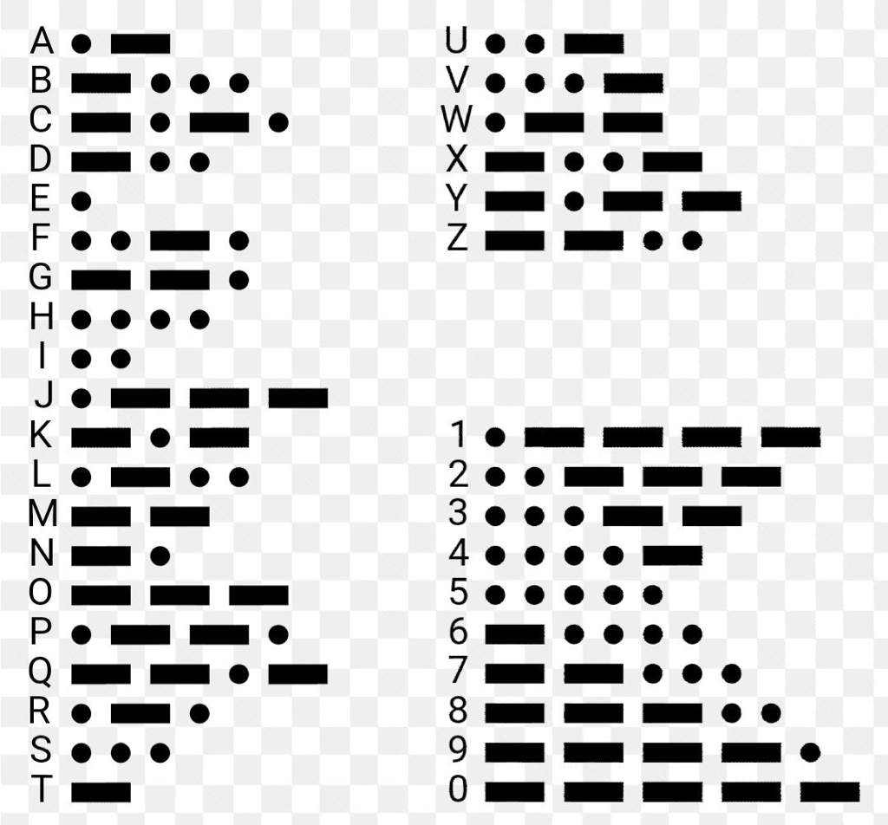

Feedback Nov 26 (you can delete this section later it will remain in the history)

|No.|How to improve        |
|-|------------- |
|①| Under the development section, you are including all the source code for the programs. It is better if you include only small parts of the code that are new to you or that show an important algorithm. This is because the source code is anyway in the repo so no need to repeat. `(Response: solved via adding new elements)`

**For example:** The code below shows how to read the status of a button connected to port 13 in the Arduino:
```.c
bool A = digitalRead(13);
```
Note that the variable A was created of type Bool since the input is binary data.|

|No.|How to improve        |
|-|------------- |
|②| Add figure caption to your figures and then explain what you see in them. Figures are quite ambiguous by themselves.`(Response: solved)`| 

**For example:**

Fig. 2. Circuit for the party lights with an Arduino

As shown in Fig. 2, the circuit for a party light system with an Arduino includes three lights. 

|No.|How to improve        |
|-|------------- |
|③| Criterion 6 needs clarification. What do you consider **high** accuracy and speed? We need specific values than can be measured during the evaluation stage.`(Response: this is solved via clarifying the meaning)`| 

-----
Martian Decoder
===========================

A communication tool for earth, Moon, and Mars.

Contents
-----
  1. [Planning](#planning)
  1. [Design](#design)
  1. [Development](#development)
  1. [Evalution](#evaluation)

Planning
----------

**Defining the problem (Tpoic 1.1.1)** 

The year 2015 is a year when interplanet traveling and planet expolration stepped onto a new stage. However, communication between different planets is still precautious and undeveloped. The station in the Earth can only communicate using Morse code, the station in the Moon can only communicate in Binary code. Communication with the station in Mars must be provided. 

Our client, the government of LWK on planet Earth(the most prosperous country in the year of 2050), is looking for a interplanet version of google translate, which includes basic functionality of being able to translate between Morse code, Binary, and Decimal messages from Mars, Earth, and Moon. In the case especially, our client is seeking for a program that provides a communication system that allows stations to communicate seamlessly using English. Also, limited the keyboard input on each planet's station to 2 push buttons where only 100w lights and buzzers are available. (see success criteria)

Therefore, the Martian Decoder is developed.

**Solution proposed**

In order to meet our clients' expectations and requirements, I decided to create this Martian Decoder based on the simpliest elements such as LED lights and buzzers aid by the Aruduino tool kit, where I code in the language of Modern C, with special requirements in Aruduino. Each step of development is demonstrated via the online platform Tinkercad. With the help of these tools, the program will be able to decode and translate the communication between Earth and Mars using Morse code, and the communication between Mars and the Moon using Binary code. All process and code of development are stored in Github.

- WHY Github

All scripts and documentation are stored in Github, making it easy to contribute to this open source projects, provide a clear documentation for the users, and showcase the project to our clients.

- WHY Tinkercad

Because Tinkercad is a free, online 3D modeling program that runs in a web browser, known for its simple interface and ease of use. Therefore making the simulation of each of our procedure extremely easy.

- WHY Arduino

An Arduino board is a one type of microcontroller based kit. Advantages of using Arduino include:
1. The software of the Arduino is well-suited with all kinds of in operation systems like Linux, Windows, and Macintosh, etc.
1. It also comes with open supply software system feature that permits tough software system developers to use the Arduino code to merge with the prevailing programing language libraries and may be extended and changed.
1. We are learning how to construct and code basic curcuits, where Arudino is a perfect toolkit for that learning purpose.
1. Comparing BASH to C

--- | BASH | C
--- | --- | ---
PROS | 1. Easy to learn and don't need ";" 2. already installed; 3. powerful with administrative tasks; 4. handy IT admin  | 1. Editing tools(IDE); 2. "Window"; 3. Users can develope their own electronic kit; 4. extremely powerful; simple syntax.
CONS | 1. syntax is unforgiving; 2. limited to terminal; 3. not a lot of resources on internet | 1. usage of additional programs to check your scripts; 2. too many unnecessary syntax

**Success criteria**

Expected measureable outcomes by the client includes:
1. Communication between Earth and Mars uses Morse code.
1. Communication between Mars and the Moon uses Binary code.
1. Provide a communication system that allow stations to communicate seamlessly using English.
1. Keyboard input on each station is limited to 2 push buttons. 
1. 100W lights are buzzers are available.
1. The output of the program(light bulbs), should be able to be identified and translated among residences clearly.
1. The program should be able to separate each language from each other.
1. The program should be able to limit all its functionality within 2 buttons.

Design
----------
### 1. Requirement of the design

- Usability
Usability is the ease of use and learnability of a human-made object such as a tool or device. In software engineering, usability is the degree to which a software can be used by specified consumers to achieve quantified objectives with effectiveness, efficiency, and satisfaction in a quantified context of use.(**keyword**: elegance, clarity, intuitive)

**Citation** “Usability.” Wikipedia, Wikimedia Foundation, 13 Nov. 2019, https://en.wikipedia.org/wiki/Usability.

- HCD(Human-centered design) 
Human-centered design is a creative approach to problem solving and the backbone of our work at IDEO.org. It’s a process that starts with the people you’re designing for and ends with new solutions that are tailor made to suit their needs. Human-centered design is all about building a deep empathy with the people you’re designing for; generating tons of ideas; building a bunch of prototypes; sharing what you’ve made with the people you’re designing for; and eventually putting your innovative new solution out in the world. (**keyword**: Feedback, discoverability)

**Citation** 
[1] “What Is Human-Centered Design?” Design Kit, https://www.designkit.org/human-centered-design.
[2] Posner J, Mars R."It's not you, bad doors are evrywhere" 2016, Retrieved (25 Nov 2019)

### 2. System diagram


[fig.1] First scratch of the system diagram explaining the general functionality of the program.

### 3. Explanation of the system diagram
- Input: the Martian decoder is a highly user-friendly program where only two buttons are designed for input, requiring really low user skills. By creating different syntax with the buttons the input is different and is able to locate on alphabets, numbers, and basic functionality such as "delete" and "send".

- Output: All message will be transmistted via light bulbs, where one (or two) light bulbs are used for each residence as different stations to communicate.

### 4. Binary to Morse code
At this point we have not fully developed the decode, yet are able to identify ways of translation morse code in binary forms.

[fig.2] Binary to Morse code


Development
----------
Nov.6th

### 1. Consider the case of a challenged person who cannot operate a keyboard or a mouse. 
What options could we provide to allow this person interact with the computer?

**Fig.1** The two ways proposed by Rikio and Uzay. Uzay's idea is based on a static alphabet where one button is used for the "next letter" and the other one "OK" for inputting the letter, with one drawback of not able to make any mistakes while typing; while Rikio's idea is based on the alphabet looping itself automaticly, therefore having the functionality of input (button"OK") and delete(button"DEL").

**my idea:**
To put multiple functionalities on the buttons, therefore making one of the buttons "func", and the other "delete". That is, to always have the alphabet displayed to users as a table(i.e 5 times 6), meantime giving the the "func" button functionalities such as "one press to the right""two press to the left""long press go down", along with the other botton with the delete fuction.

### 2. Create a traffic light using Arduino


[fig.3] demonstration screenshot from tinkercard

- Here are the code for how to **void setup**

```c,.h
void setup()
{
  pinMode(red, OUTPUT);
  pinMode(yellow, OUTPUT);
  pinMode(green, OUTPUT);
  digital.write(green, HIGH);
}
```

- Code below shows how to connect to port 10
```c,.h
 int red = 10;
```

_complete code for traffic light:_
```c,.h
 int red = 10;
 int yellow = 9;
 int green = 8;

void setup()
{
  pinMode(red, OUTPUT);
  pinMode(yellow, OUTPUT);
  pinMode(green, OUTPUT);
  digital.write(green, HIGH);
}

void loop()
{
  changeLights();
    delay(15000);
}

void changeLights(){
    // green off, yellow on for 3 seconds
    digitalWrite(green, LOW);
    digitalWrite(yellow, HIGH);
    delay(3000);

    // turn off yellow, then turn red on for 5 seconds
    digitalWrite(yellow, LOW);
    digitalWrite(red, HIGH);
    delay(5000);

    // red and yellow on for 2 seconds (red is already on though)
    digitalWrite(yellow, HIGH);
    delay(2000);

    // turn off red and yellow, then turn on green
    digitalWrite(yellow, LOW);
    digitalWrite(red, LOW);
    digitalWrite(green, HIGH);
    delay(3000);
}
```

__demonstration:__ 


[fig.4] Gif demonstration of the program

**_Problem(fixed): how do variables and 'void' work in arduino_**

Sol to the first problem:


[fig.5] Variables in arduino

**void**: The void keyword is used only in function declarations. It indicates that the function is expected to return no information to the function from which it was called.

_reference:_ “Void.” Arduino Reference, https://www.arduino.cc/reference/tr/language/variables/data-types/void/.

### 3. Converting decimals to binary, shown by LED lights how to count from 0 to 15

- How to count from 0 to 15 in binary:

Dec | BIN | Hexadecimal
--- | --- | ---
0 | 0000 | 0
1 | 0001 | 1
2 | 0010 | 2 
3 | 0011 | 3
4 | 0100 | 4
5 | 0101 | 5
6 | 0110 | 6
7 | 0111 | 7
8 | 1000 | 8
9 | 1001 | 9
10 | 1010 | A
11 | 1011 | B
12 | 1100 | C
13 | 1101 | D
14 | 1110 | E
15 | 1111 | F

_This code shows how to convert decimals to binary (up to 4 binary digits), shown by 4 LED lights, uisng number 5, 10, and 8 as an example_

```c,.h
int LED1 = 8;
int LED2 = 9;
int LED3 = 10;
int LED4 = 11;

void setup()
{
  pinMode(LED1, OUTPUT);
  pinMode(LED2, OUTPUT);
  pinMode(LED3, OUTPUT);
  pinMode(LED4, OUTPUT);
}

void loop()
{
  binary(5);
  delay(2000);
  binary(10);
  delay(2000);
  binary(8);
}

void binary(int num)
{
  if( num%2 == 0 )
  {
    digitalWrite(LED1, LOW);
  }
    else if( num%2 == 1 )
    {
      digitalWrite(LED1, HIGH);
  }
  if( num%4 > 1)
  {
    digitalWrite(LED2, HIGH);
  }
    else
    {
      digitalWrite(LED2,LOW);
  }
  if ( num%8 >= 4)
  {
    digitalWrite(LED3, HIGH);
  }
    else
    {
      digitalWrite(LED3, LOW);
  }
  if ( num%16 >= 8)
  {
    digitalWrite(LED4, HIGH);
  }
    else
    {
      digitalWrite(LED4, LOW);
  }
}
```
_demonstration:_ 


[fig.3] Gif demonstrtaion of the program

**_Problem(fixed): how to convert decimal numbers to binary numbers?_**

Sol: find the pattern digit by digit, and use mode to display each LEDlight.

### 4. Create one program curcuit that implements each of the tables below:

- table 1

Button A | Button B | Out 1 | Out 2
--- | --- | --- | ---
0 | 0 | 1 | 0
0 | 1 | 0 | 1
1 | 0 | 1 | 1
1 | 1 | 0 | 0

- table 2

Button A | Button B | Out 1 | Out 2
--- | --- | --- | ---
0 | 0 | 1 | 0
0 | 1 | 0 | 1
1 | 0 | 0 | 1
1 | 1 | 1 | 1

- table 3

Button A | Button B | Button C | Out 1 | Out 2
--- | --- | --- | --- | ---
0 | 0 | 0 | 1 | 1
0 | 0 | 1 | 1 | 1
0 | 1 | 0 | 1 | 0
0 | 1 | 1 | 1 | 0
1 | 0 | 0 | 0 | 1
1 | 0 | 1 | 1 | 1
1 | 1 | 0 | 1 | 1
1 | 1 | 1 | 1 | 1


**First attempt for this question:**

```c,.h

// Set variable names to ports on arduino
int butA = 13;
int butB = 12;
int butC = 11;
int out1 = 3;
int out2 = 4;


//define which ports are inputs and which are outputs
void setup ()
{
  pinMode(butA, INPUT);
  pinMode(butB, INPUT);
  pinMode(butC, INPUT);
  pinMode(out1, OUTPUT);
  pinMode(out2, OUTPUT);
}

//turning lights on and off based on pressed buttons
void loop()
{
  if (digitalRead(butA) == LOW && digitalRead(butB) == LOW && digitalRead(butC) == LOW){
 		digitalWrite(out1, HIGH);
  		digitalWrite(out2, HIGH); }
  else if (digitalRead(butA) == LOW && digitalRead(butB) == LOW && digitalRead(butC) == HIGH){
 		digitalWrite(out1, HIGH);
  		digitalWrite(out2, HIGH); }
  else if (digitalRead(butA) == LOW && digitalRead(butB) == HIGH && digitalRead(butC) == LOW){
 		digitalWrite(out1, HIGH);
  		digitalWrite(out2, LOW); }
  else if (digitalRead(butA) == LOW && digitalRead(butB) == HIGH && digitalRead(butC) == HIGH){
 		digitalWrite(out1, HIGH);
  		digitalWrite(out2, LOW); }
  else if (digitalRead(butA) == HIGH && digitalRead(butB) == LOW && digitalRead(butC) == LOW){
 		digitalWrite(out1, LOW);
  		digitalWrite(out2, HIGH); }
  else if (digitalRead(butA) == HIGH && digitalRead(butB) == LOW && digitalRead(butC) == HIGH){
 		digitalWrite(out1, HIGH);
  		digitalWrite(out2, HIGH); }
  else if (digitalRead(butA) == HIGH && digitalRead(butB) == HIGH && digitalRead(butC) == LOW){
 		digitalWrite(out1, HIGH);
  		digitalWrite(out2, HIGH); }
  else {
 		digitalWrite(out1, HIGH);
  		digitalWrite(out2, HIGH); }
}
```

**Second attempt for this question - convert binary to decimal:**

```c,.h
int butA = 10;
int butB = 11;
int butC = 12;
int led1 = 3;
int led2 = 4;
void setup()
{
  pinMode(butA, INPUT);
  pinMode(butB, INPUT);
  pinMode(butC, INPUT);
  pinMode(led1, OUTPUT);
  pinMode(led2, OUTPUT);
}
int decimal;
void loop()
  
{
  decimal = digitalRead(butA)*pow(2,2);
  decimal += digitalRed(butB)*pow(2,1);
  decimal += digitalRead(butC)*pow(2,0);
  
  if(decimal < 2 || decimal > 4) {
    digitalWrite(led1, HIGH);
    digitalWrite(led1, HIGH);
  }
  if (decimal == 4)
  {
    digitalWrite(led1, LOW);
    digitalWrite(led2,HIGH);
  }
  if (decimal == 2 || decimal ==3)
  {
    digitalWrite(led1, HIGH);
    digitalWrite(led2, LOW);
  }
  
}
```

- Comparison for the two attempts

--- | Attempt 1 | Attempt 2 
--- | --- | ---
Pros | Easier to understand; not converting to decimal | short; scalable
Cons | more lines of codes; not scalable | when there is not pattern in the outputs becomes attempt 1 


**Third attempt for this question - using logic gates**

```c,.h
int butA = 13;
int butB = 12;
int butC = 11;
int out1 = 3;
int out2 = 4;

void setup()
{
  pinMode(butA, INPUT);
  pinMode(butB, INPUT);
  pinMOde(butC, INPUT)
  pinMode(out1, OUTPUT);
  pinMode(out2, OUTPUT);
    
}

bool a void loop()

{
bool A = digitalRead(butA);
bool B = digitalRead(butB);
bool C = digitalRead(butC);
bool a = B | (!A & !B) | (C & A)
bool b = A | (!A & !B)
 digitalWrite(out1, a);
 digitalWrite(out2, b);
}
```

**_Problem(fixed): logic gates in Aruduino_**

Reference: Instructables. “Universal Logic Gates Implementer With Arduino.” Instructables, Instructables, 21 Sept. 2017, https://www.instructables.com/id/Universal-Logic-Gates-Implementer-With-Arduino/.


### 5. Introduction to binary logic gates

- logic gates:


[fig.6] Logic gates rules

Citation: “Chapter 3-Logic Gates and Logic Circuits.” IGCSE Computer Science, 24 Sept. 2017, https://avyscomputerscienceblog.wordpress.com/chapter-3/.


### 6. building an electronic number screen

From all investigated above, we are able to create an electronic number screen at this stage with 7 LEDs. The goal is to print out 0 to 7 on the screen using logic gates. (Nov.20th, Collaborated with Tuan)

- Working in process:


[fig.7,8] Working in progress

**fig** Steps taken to get the formula for each letter.


[fig.9,10,11] Steps of calculation

Final code: 
```c,.h
int LEDA = 1;
int LEDB = 2;
int LEDC = 3;
int LEDD = 4;
int LEDE = 5;
int LEDF = 6;
int LEDG = 7;
int butA = 10;
int butB = 11;
int butC = 12;


void setup()
{
  pinMode(LEDA, OUTPUT);
  pinMode(LEDB, OUTPUT);
  pinMode(LEDC, OUTPUT);
  pinMode(LEDD, OUTPUT);
  pinMode(LEDE, OUTPUT);
  pinMode(LEDF, OUTPUT);
  pinMode(LEDG, OUTPUT);
  pinMode(butA, INPUT);
  pinMode(butB, INPUT);
  pinMode(butC, INPUT);
  
}

void loop()
{
   bool A = digitalRead(butA);
   bool B = digitalRead(butB);
   bool C = digitalRead(butC);
   bool a = (!C & !A) | (B & !A) | (!C & A) | (A & !B);
   bool b = (!C & A) | (!B & !A) | (A & !B);
   bool c = (!A & !C) | (!A & !B) | (!C & B);
   bool d = (!A & !C) | (!A & B) | (B & !C) | (C & A & !B);
   bool e = A | (!C & !B) | (C & B);
   bool f = (!A & B) | (!C & !A) | (!C & !B);
   bool g = (!A & B) | (B & !C) | (A & !B);
   digitalWrite(LEDA, a);
   digitalWrite(LEDB, b);
   digitalWrite(LEDC, c);
   digitalWrite(LEDD, d);
   digitalWrite(LEDE, e);
   digitalWrite(LEDF, f);
   digitalWrite(LEDG, g);
                    
}
```

Demonstration:


[fig.12] Gif demonstrtaion of the program

**_Problem(fixed): there are some problem with the code that the LED is not able to display in order._**

### 7. Developing the input system 

#### Step one: Enter english text show in the serial monitor use the LCD screen
1. Solution 1: *The use of matrix array*


[fig.13] How the matrix array work.

- Explanation: in this case, all digits, numbers, and options are stored into a matrix array, where each of the syntax can be reached through clicking the buttons for different times(i.e letter "e" can be reached via clicking both buttons one time). Within this designing process, the functionality of "interruption" is often used. 

_Interrupts_: An Interrupt's job is to make sure that the processor responds quickly to important events. When a certain signal is detected, an Interrupt (as the name suggests) interrupts whatever the processor is doing, and executes some code designed to react to whatever external stimulus is being fed to the Arduino. Once that code has wrapped up, the processor goes back to whatever it was originally doing as if nothing happened. 

**Coding part**
Below is the code demonstrating this solution
```c,.h
String text = "";
int index = 0; 
// add all the letters and digits to the keyboard

String keyboard[38]={"a", "b", "c", "d", "e", "f", "g", "h", "i", "j", "k", "l", "m", "n", "o", "p", "q", "r", "s", "t", "u", "v", "w", "x", "y", "z", "0", "1", "2", "3", "4", "5", "6", "7", "8", "9", "SENT", "DEL"};
int numOptions = 38; //size of keyboard 

void setup()
{
  Serial.begin(9600);
  attachInterrupt(0, changeLetter, RISING);//button A in port 2
  attachInterrupt(1, selected, RISING);//button B in port 3
}

void loop()
{
  Serial.println("Option (Select:butB, Change:butA): " + keyboard[index]);
  Serial.println("Message: "+ text);
  delay(100);
}

//This function changes the letter in the keyboard
void changeLetter(){
  index++;
    //Explain what the functionality of the if condition below 

  if(index>numOptions){
  	index=0; //loop back to first row
  } 
}

void selected() {
  String key=keyboard[index];
	if ( key == "DEL" ) {
	int len = text.length();
	text.remove(len-1);
	} else if ( key == "SEND") {
	Serial.print('Message sent');
	text = "";
	} else {
 	text = text +  key;
	}
	index=0; 

}
```
2. Solution 2: using scroll, interrupt. (By Tuan and Lingye)


[fig.14] Program demonstrated in Tinkercad

Below is the demonstrative diagram for the idea:


Explanation: This program inputs all digits, numbers, and general options "delete" and "send" into the first row of LCD, uisng the functionality of "scroll" and "interruption" to control the first row to scroll left or right, where the input is always on the first letter of the first row. The sidplay of the letters users chose are displayed on the second row.

- Example of scroll:

```c,.h
  lcd.scrollDisplayRight();  
      } if (timepress1 > 6000){
```

- Example of interruption:

```c,.h
long last_interrupt_time1 = 0;
   long interrupt_time1 = millis();
   long timepress1 = millis();
   if(interrupt_time1 - last_interrupt_time1 > 200) {
      if(digitalRead(but2) == HIGH){
      press2++;
```

Functionality:
[1] But1: Scroll the first row to the right by 1
[2] But2: Scroll the first row to the left by 1

Working in process:


[fig.15,16,17] Photos of working in process

- Code so far: 
```c,.h
// include the library code:
#include <LiquidCrystal.h>


// initialize the library with the numbers of the interface pins
LiquidCrystal lcd(12, 11, 5, 4, 7, 6);

int but1 = 2;
int but2 = 3;
int Col1 = 0;
int Row1 = 0;
int Col2 = 0;
int Row2 = 1;
int press1 = 0;
int press2 = 0;
int x =0;
String text = "";

char letter[]={'a','b','c','d','e','f','g','h','i','j','k','l','m','n','o','p','q','r','s','t','u','v','x','y','z','w','1','2','3','4','5','6','7','8','9','0', ' '};
void setup() {
  // set up the LCD's number of columns and rows:
  lcd.begin(16, 2);
  
  pinMode(but1, INPUT);
  pinMode(but2, INPUT);
  
  for(int i=0; i < 38; i++){
    lcd.print(letter[i]);
    delay(100);
  }
   

}

void loop() {
  attachInterrupt(0, hpress1, CHANGE);
  attachInterrupt(1, hpress2, CHANGE);

}
  
 void hpress1(){
    
   long last_interrupt_time = 0;
   long interrupt_time = millis();
   long timepress2 = millis();
   if(interrupt_time - last_interrupt_time > 200) {
     if(digitalRead(but1) == HIGH){
      press1++;
     } if (press1 == 1){
        x--;
        press1 = 0;
      lcd.scrollDisplayLeft();  
      } if (timepress2 > 6000){
       lcd.setCursor(0, 1);
       lcd.blink();
       lcd.print("hii");
      
   }
     timepress2 = last_interrupt_time;
 }
 }
  void hpress2(){
    
   long last_interrupt_time1 = 0;
   long interrupt_time1 = millis();
   long timepress1 = millis();
   if(interrupt_time1 - last_interrupt_time1 > 200) {
      if(digitalRead(but2) == HIGH){
      press2++;
     } if (press2 == 1){
        x--;
        press2 = 0;
      lcd.scrollDisplayRight();  
      } if (timepress1 > 6000){
       lcd.setCursor(0, 1);
        lcd.blink();
        lcd.print("hello");
      }
     
     
   last_interrupt_time1=interrupt_time1;
   timepress1 = last_interrupt_time1;  
   }
  }


```


Evaluation
----------

- Will be updated when the project is finished
- all citation are in-text citation

